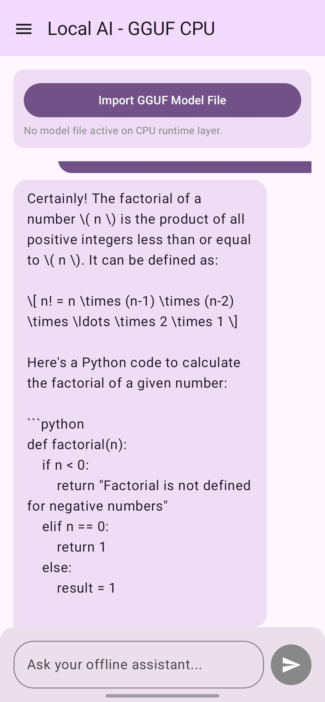
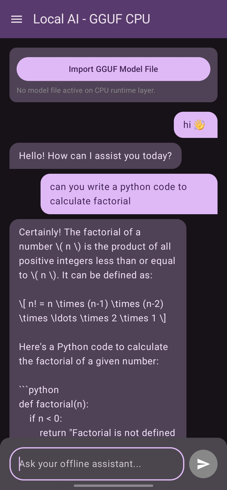

# Local-Ai-GGUF-Edition


A privacy-first, fully offline, on-device AI conversational assistant for Android. This application runs quantized Large Language Models (LLMs) locally on the device's CPU track using a high-performance native C++ execution engine built on top of `llama.cpp`. No data ever leaves your device—no APIs, no network requests, and zero tracking.

## ✨ Features

*   **100% Offline Inference:** Runs quantized `.gguf` models locally on your device's internal CPU architecture using zero-alloc native memory layouts.
*   **Persistent Multi-Chat Sessions:** Features a ChatGPT/Gemini-style persistent side menu. Conversations are sandboxed into a structured JSON file hierarchy, allowing you to manage multiple isolated threads that survive application restarts.
*   **Material You Dynamic Themeing:** Integrates a system-aware UI engine that extracts active device wallpaper tokens and system preferences to adapt beautifully between light and dark modes dynamically.
*   **Keyboard Inset Optimization:** Implemented using active compose `imePadding()` to handle screen sizing gracefully when typing long multi-line prompt structures.
*   **Asynchronous Processing Indicators:** Features a smooth alpha-pulsing token evaluation status card to track active generation cycles seamlessly.
*   **Optimized Prompt Templates:** Tailored out-of-the-box to structure user turns inside the clean ChatML template layout required for advanced models like Qwen 2.5 Coder.

---

## 🛠️ Tech Stack & Architecture

*   **UI Layer:** 100% Jetpack Compose using full Material 3 components (`ModalNavigationDrawer`, `Scaffold`, `LazyColumn`).
*   **Asynchronous Stream:** Built utilizing Kotlin `Coroutines` and reactive `StateFlow` architectures for UI state propagation.
*   **Persistence:** Light-weight asset sandboxing implemented using `Kotlin Serialization (Json)`.
*   **Native Bridge Layer:** Handcrafted JNI / Android NDK C++ integration layers parsing low-level Linux file descriptors via `/proc/self/fd/` tracks for memory-safe model initialization.

---

## 📱 Interface Preview

| Light Mode (System Tint) | Dark Mode (System Tint) |
| :---: | :---: |
|  |  |

## 🚀 Getting Started

### Prerequisites
* An Android device running **Android 12 (API Level 31) or higher** (for full Dynamic Color extraction support).
* A quantized Large Language Model in **`.gguf`** format. We highly recommend small parameter models optimized for mobile layouts, such as:
  * Qwen 2.5 Coder 0.5B / 1.5B (Instruct variants)
  * Llama 3.2 1B / 3B (Instruct variants)
  * Phi-4 Miniature variants
### 📥 Recommended Models

Since this app runs entirely on your device's CPU, we recommend using highly optimized, small-parameter models (Instruct/Chat variants). You can download them directly from Hugging Face:

*   **[Qwen 2.5 Coder 1.5B GGUF](https://huggingface.co/Qwen/Qwen2.5-Coder-1.5B-Instruct-GGUF)** - *Highly recommended for coding, logic, and general assistance.*
*   **[Llama 3.2 1B GGUF](https://huggingface.co/unsloth/Llama-3.2-1B-Instruct-GGUF)** - *Extremely lightweight, lightning-fast generation speeds on mobile CPUs.*
*   **[Phi-4 Mini GGUF](https://huggingface.co/QuantFactory/phi-4-mini-instruct-GGUF)** - *Great for complex reasoning tasks.*

> 💡 **Tip:** For the best balance of speed and intelligence on a smartphone, look for files ending in **`Q4_K_M.gguf`** (4-bit medium quantization) or **`Q5_K_M.gguf`** (5-bit medium quantization).
### Installation & Setup

1. **Download the App:** Clone this repository and compile the build locally via Android Studio, or download the compiled standalone binary executable straight from our latest [Releases](https://github.com/swagatambordoloi/Local-Ai-GGUF-Edition/releases) tab.
2. **Install the APK:** Open the downloaded `Local Ai GGUF Edition.apk` file on your device. Ensure you have allowed *"Install from unknown sources"* in your Android security parameters.
3. **Import a Model:** 
   * Tap the **Import GGUF Model File** action card at the top of the main dashboard.
   * Select your locally stored `.gguf` file from your device's internal storage directory.
   * The application will securely sandbox the model and prepare the background CPU runtime layers.
4. **Chat freely:** Type your prompt into the execution panel at the bottom anchor and click send!

---

## 📂 Repository Structure

```text
├── app/
│   ├── src/
│   │   ├── main/
│   │   │   ├── cpp/            # Native C++ Llama Engine & JNI Bridge Core
│   │   │   └── java/com/example/localaiggufedition/
│   │   │       ├── MainActivity.kt # Core Lifecycle & Window Inset Engine Hook
│   │   │       ├── MainScreen.kt   # Jetpack Compose UI Board & Session Drawers
│   │   │       └── Theme.kt        # Material You Dynamic Theme Configurations
│   └── build.gradle.kts        # Android build configuration script
└── README.md                   # Project documentation
```
##🔒 Privacy & Data Policy
Local AI runs entirely sandboxed. It requires no networking permissions (android.permission.INTERNET is completely absent from the manifest configuration). Your logs, inputs, weights, and conversation trees remain entirely on your own physical hardware indefinitely.

## 🔮 Roadmap & Upcoming Features

*   **Vulkan Compute Hardware Acceleration:** Actively engineering an upcoming release utilizing `llama.cpp`'s Vulkan backend to offload matrix multiplication workloads onto the device's mobile GPU track, drastically increasing tokens per second.
*   **Token-by-Token Streaming UI:** Transitioning the conversational generation loop from block-rendering to a real-time reactive stream interface.
*   **System Prompt Customization:** Adding a dedicated configurations panel to let users inject custom system instructions and modify temperature bounds per session.
